# Claw'd on ESP32 + ST7789

Claude Code's pixel crab mascot, **Claw'd**, animated on a TTGO T-Display
(ESP32 + 240×135 ST7789V color IPS TFT).

## Demo (real hardware)


*Recorded on the actual board.* Full-quality clip: [assets/device_demo.mp4](assets/device_demo.mp4)

## Hardware

- **Board:** TTGO T-Display (ESP32-D0WDQ6, 16 MB flash)
- **Display:** ST7789V, 240×135, SPI
- **Pin map**

  | Signal | GPIO |        | Signal | GPIO |
  |--------|------|--------|--------|------|
  | MOSI   | 19   |        | DC     | 16   |
  | SCLK   | 18   |        | RST    | 23   |
  | CS     | 5    |        | BL     | 4    |
  | BTN_L  | 35   |        | BTN_R  | 0    |

## Animations

Nine poses faithful to the official Claw'd animations, auto-cycling every 7 s.
The two onboard buttons switch modes (left = previous, right = next).

For each animation below: the **GIF** is the live loop, the **four stills** are key frames.
All of these are rendered by [`tools/render_anim.py`](tools/render_anim.py), a 1:1 port
of the firmware's sprite/pose math — so the docs match the device pixel-for-pixel.

### 1. WALK
Looks around, crouches, jumps across the screen in an arc, lands, leaps back.

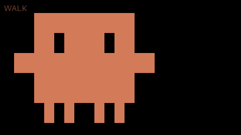<br>
 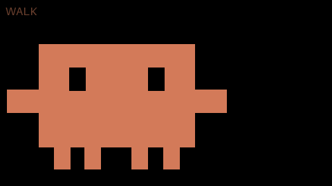 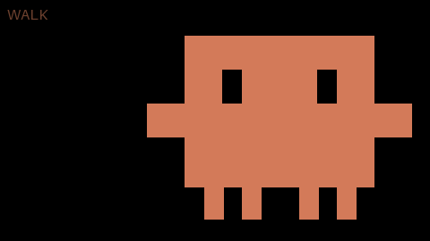 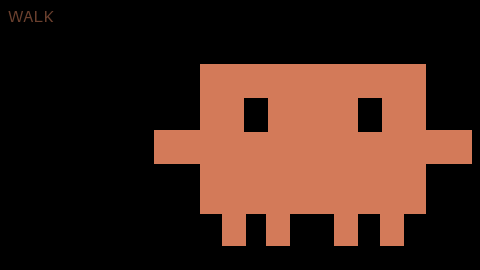

### 2. STOMP
Tilts left and right stomping, firing confetti bursts at each peak.

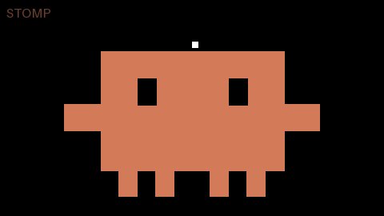<br>
 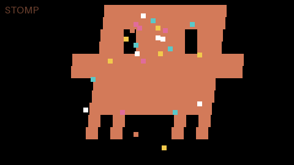 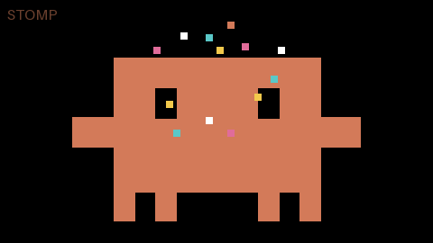 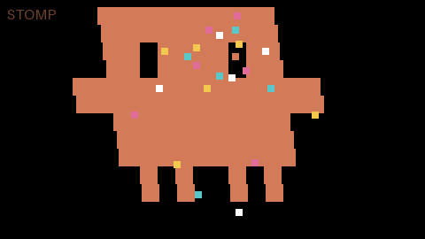

### 3. FLAG
Waves a flag while the body sways the opposite way.

<br>
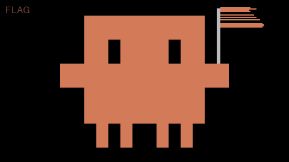 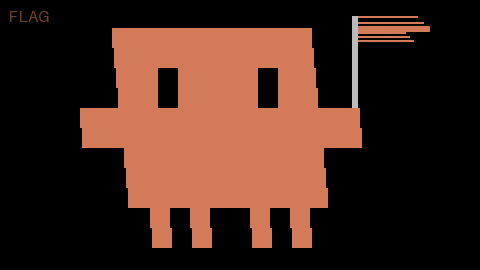 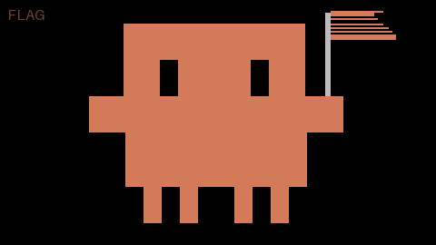 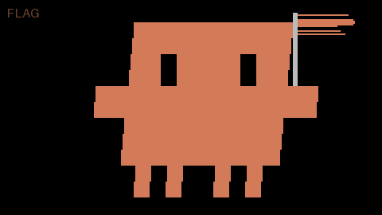

### 4. GYM
Dumbbell curls.

<br>
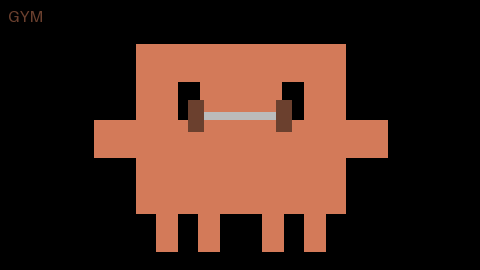 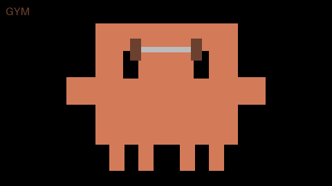 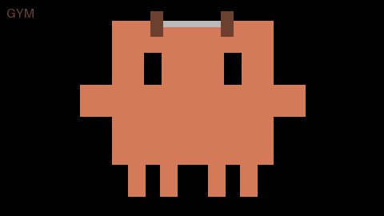 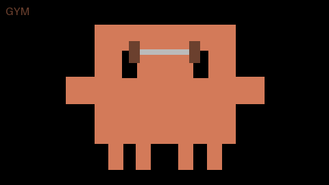

### 5. LOOK
Eyes dart left, center, right.

<br>
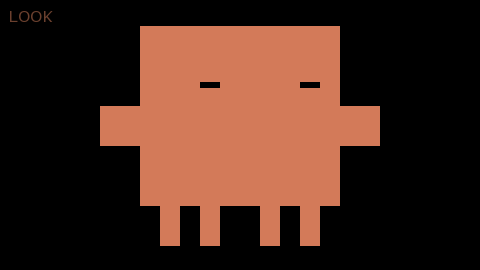  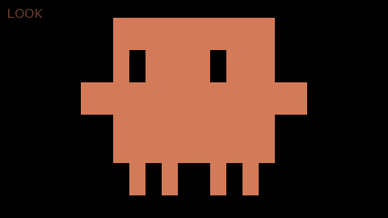 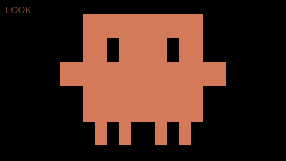

### 6. NAP
Eyes closed, gentle breathing.

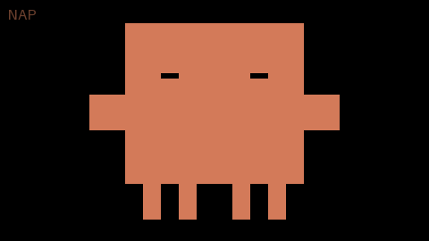<br>
   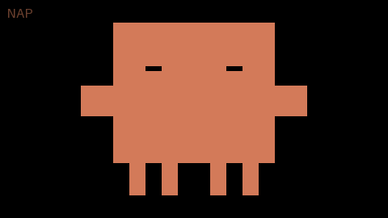

### 7. WAVE
Waves hello with a swinging hand.

<br>
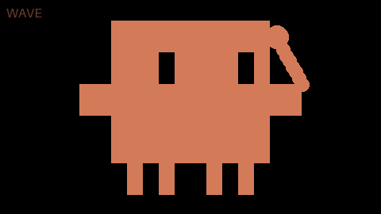 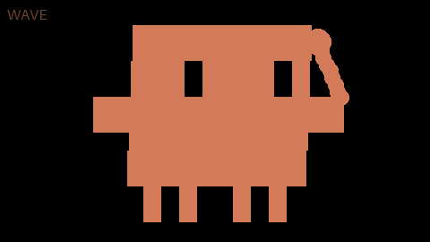 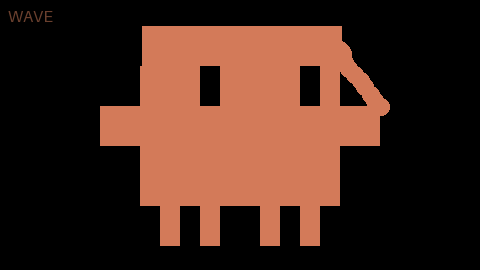 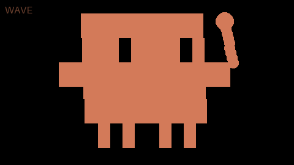

### 8. APPLE
A dropped apple falls; Claw'd scuttles over, eats it, and hops happily.

<br>
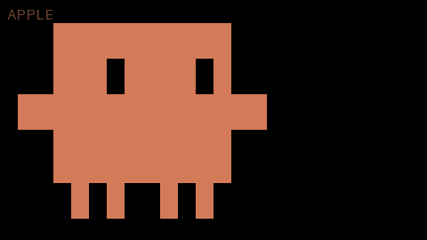 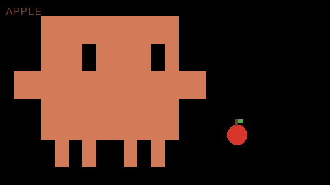 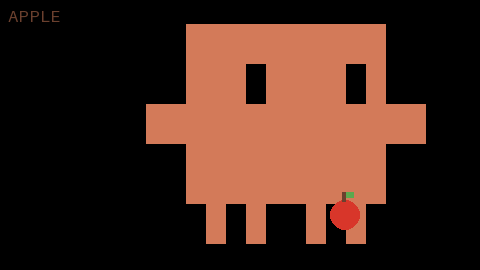 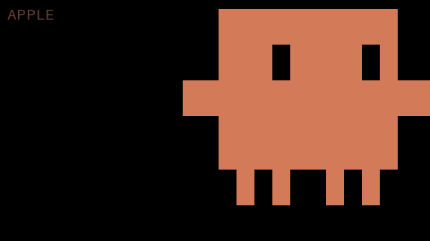

### 9. SPIN
Turns around in place.

<br>
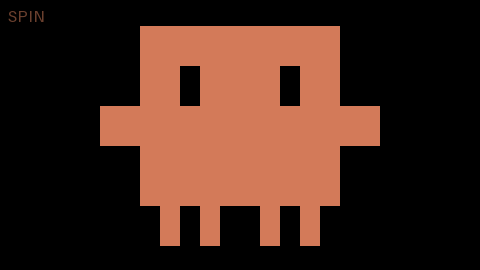 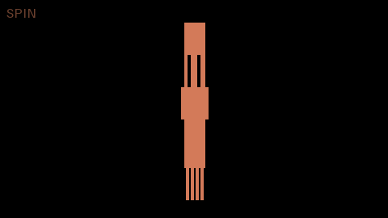 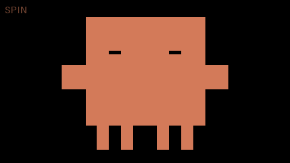 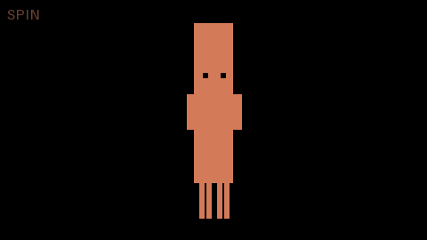

## Build & flash

Uses [arduino-cli](https://arduino.github.io/arduino-cli/) with the ESP32 core
and the *GFX Library for Arduino*.

```sh
arduino-cli core install esp32:esp32
arduino-cli lib install "GFX Library for Arduino"

# NOTE: this USB-serial adapter is unreliable at the default 921600 baud,
# so pin the upload speed to 115200.
PORT=/dev/cu.usbserial-XXXXXXXXXX
arduino-cli compile --fqbn esp32:esp32:esp32 claude_mascot
arduino-cli upload  --fqbn esp32:esp32:esp32:UploadSpeed=115200 -p $PORT claude_mascot
```

## Regenerate the GIFs / PNGs

```sh
python3 -m pip install Pillow
python3 tools/render_anim.py     # writes assets/*.gif and assets/keys/*.png
```

## Layout

- `claude_mascot/` — the mascot firmware (`claude_mascot.ino` + `pose.h`)
- `tools/render_anim.py` — renders the animation GIFs and key-frame PNGs
- `tdisplay_test/` — ST7789 bring-up / color-bar test
- `i2c_scan/` — multi-pin I2C scanner used while identifying the display
- `assets/` — generated GIFs, key-frame PNGs, and the device demo clip
